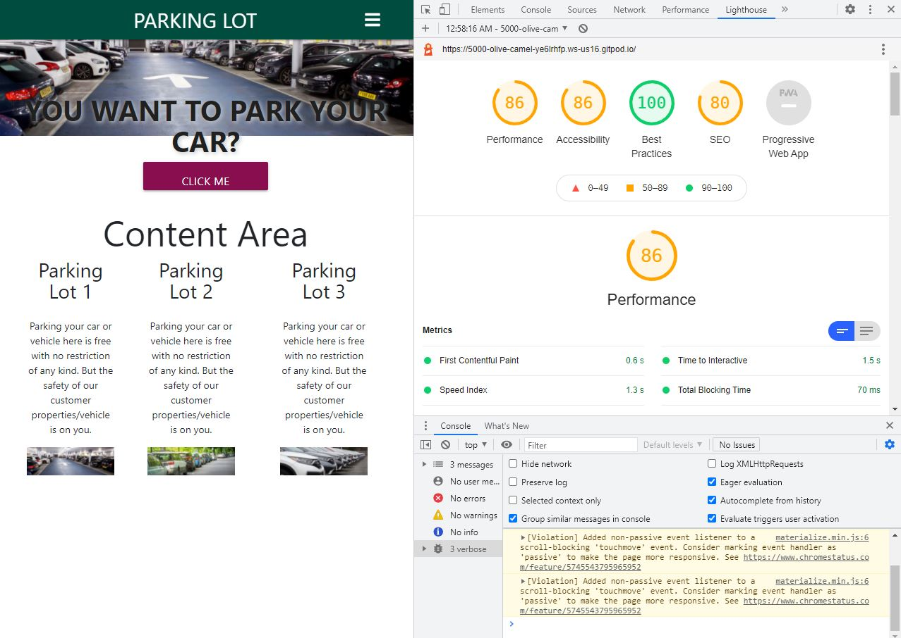

# VEHICLE PARKING APP

## User-Centric Backend Development Milestone Project.

The Vehicle parking app is dedicated to giving a simple parking system to any organisation with several parking lots, making it a one touch system. It allows user input edit and delete their car information already in the system. This app/website is interactive, user friendly and easy to navigate in and out of it.

This website/App is presented by Ochuko Erewive. A milestone Project for "Full Stack Developer Course in Code Institude". And it is for educational purposes.
#

## USER EXPERIENCE (UX)
The goal of the Websites/App is to provide a sactisfactory user experience and to make parking your car in a parking lot more easier without a physical communication.This could be done via their phones, computer or tablets or what eveer choices of devices they wish to use.
#
## USER STORIES
+ As a user, I would like to create my account so as to have access to the site fully.
+ As a user, I would like to view my car information in my profile page after inputting my parking information into the system.
+ As a user, I would like to have full access to my own parking information whereby I can edit and delete my own information by my self.
+ As a user, I would like a button that leads straight to the form from the home page.
#
## UX FRAMEWORK
1. STRATEGY

The Vehicle parking app is to provide a simple system that everyone can relate with both the front-end and the back-end functionality. It is created using HTML, CSS,JAVASCRIPT, PYTHON, FLASK AND MONGODB. The main goal is to create a user-friendly app for easy navigation.

2. Scope (Functional Requirements)

The website/app is interactive and allows users to input information, edit and also delete information when they are done. This website has CRUD functionality.

The functionality requirements includes the following:
+ Menu
+ Park Your Car
+ Profile Page
+ Database functionality that stores users login information and ability to create an account with authentication. In addition, the website/app should be responsive for various screen sizes, whilst maintaining the same level of functionality. 
The main functionality of the website is to allow users to create,read, update and also delete data (CRUD). The data created is stored in a database and can be r ead read through various pages in the app/website. The users also have the option to update and edit the data they have submitted as well as delete it together.
#

3. Structure
The website, when luch open as a new user, it gives you the option to register or login or visit the home page. To log in is to have first, registered in which means that your information as regards login in is stored already in the database after login into the site, it takes you straight to your profile page which maybe empty because you haven't put in your car information into the system. From the navigation bar, you can put in your car information by clicking "Park Your Car".

4. Skeleton

+ Materialize will be utilized, and some additional manual input as regards to using bootstrap. Use of CSS to align to a position.
+ A navigation bar will allow users to go to their chosen pages.
+ Users should be able to edit and delete from their profile page.

5. Surface
+ Use of Font Awesome
+ Navigation color: #004d40 teal darken-4
+ Button color: pink darken-4
+ Font color: black
+ link Color: pink

## WIREFRAME
The wireframes was designed using corel-draw platforms. It can be located in a folder called "Wireframes" and also it is uploaded to github for assessment.
#
## FEATURES
### Existing Features
1.  Register functionality
2.  Login functionality
3.  Logout functionality
4.  Profile page
5.  User creating a parking log
6.  Working Navbar
7.  Edit/Delete functionality for the user

#

## TECHNOLOGY USED
The main technologies used for this project are as follows:
1.   HTML5 - Used to create the basic code and structure for the website/app.
2.  CSS3 - Used to style the elements of the webpage.
3.  JavaScript - For mobile responsive navbar
4.  Flask Framework - Used as the main framework for the website.
5.  MongoDB - Used to store and retrieve the data created from the website.
6.  Python 3.8.11 - Used for routing and support alongside MongoDB and for interaction between pages.
7.  Materialize CSS - To provide styling and structure for the elements on the webpage.
8.  BootStrap.
9.  Google Chrome browser Developer Tools - Used for testing during development.

All other installed packages are listed in requirements.txt
#

## TESTING
The site was tested in google chrome, mozilla and windows browsers.

# Compatibility testing
Also tested across multiple mobile devices and bowsers.

Tested on hardware devices, using Dell and Hp pcs.

# Performace testing

## Code Validation

+ W3C CSS Validator to validate CSS.
+ Nu Html Checker to test HTML.
Python code was validated using the ExtendsClass Python Syntax Checker with no syntax errors found.
#

# DEOLOYMENT
1.  To clone the repository, type the following command into your terminal:
 * git clone https://github.com/ochukoerewive/ms3project
 2. Change your directory to the cloned directory using the CD command in the terminal.

3.  Create an env.py file in the root directoy and set up the following environment variables to link to your MongoDB Atlas:

+   At the top of the file, import os
+   Create the MONGO_URI and SECRET_KEY variables
+   Set the IP and PORT
4.  Install the requirements.txt file using: 'pip3 install -r requirements.txt'

This is the basic starting point before .py files are created.

## Heroku Deployment
To deploy the app using Heroku, the following steps are required:

1.  Use pip3 freeze > requirements.txt to create a list of the dependencies for the website.
2.  Create a Procfile for Heroku using this command: echo web: python app.py > Procfile
3.  Use git add -A , git commit -m "(Your commit message)" , and git push , to push these files to your GitHub repository.
4.  Navigate to Heroku and log in.
5.  Create a new app by navigating to 'New' and 'Create New App'. Enter your app name and select your region and create app.
6.  Under the 'Deploy' tab, select 'GitHub - Connect to GitHub'.
7.  Enter your repository's name in the input field, and connect once found.
8.  To set your environment variables navigate to the 'Settings' tab and scroll down to 'reveal config vars'

## Credits

### Content
The content was created by following the Code Institute tutorial for the Flask Task Manager project as a base, and heavily modified by myself to suit my use case

## Acknowledgements
* Code Institute group on slack
+ Tutor support team