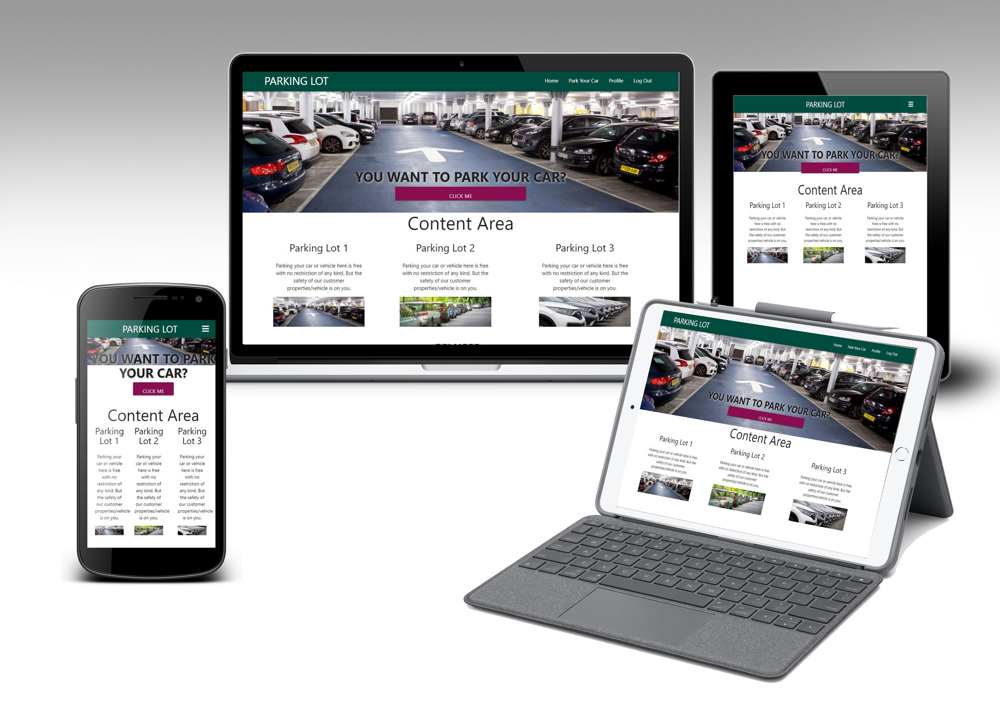

# VEHICLE PARKING APP

## User-Centric Backend Development Milestone Project.

The Vehicle parking app is dedicated to giving a simple parking system to any organisation with several parking lots, making it a one touch system. It allows user input edit and delete their car information already in the system. This app/website is interactive, user friendly and easy to navigate in and out of it.

This website/App is presented by Ochuko Erewive. A milestone Project for "Full Stack Developer Course in Code Institude". And it is for educational purposes.
#

## USER EXPERIENCE (UX)
The goal of the Websites/App is to provide a sactisfactory user experience and to make parking your car in a parking lot more easier without a physical communication.This could be done via their phones, computer or tablets or what eveer choices of devices they wish to use.
#
## USER STORIES
+ As a user, I would like to create my account so as to have access to the site fully.
+ As a user, I would like to view my car information in my profile page after inputting my parking information into the system.
+ As a user, I would like to have full access to my own parking information whereby I can edit and delete my own information by my self.
+ As a user, I would like a button that leads straight to the form from the home page.
#
## UX FRAMEWORK
1. Strategy
2. Scope (Functional Requirements and Content Requirements)
3. Structure
4. Skeleton
5. Surface

## WIREFRAME
## FEATURES
### Existing Features
### Upcoming Features
#
## TECHNOLOGY USED
### SECURITY
#
## TESTING

# DEOLOYMENT